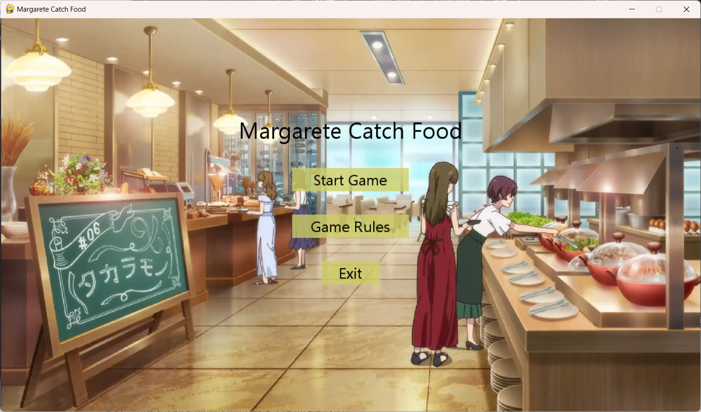
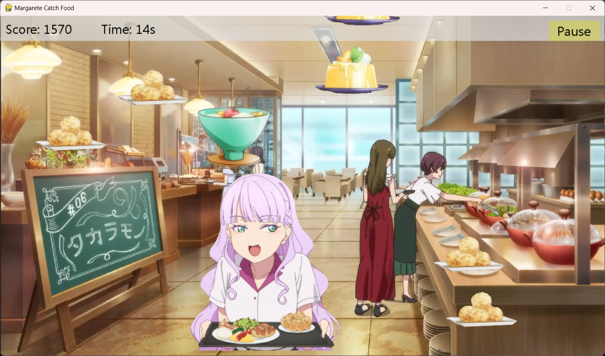

# Margarete Catch Food 

## 简介
如标题所示，衍生自ラブライブ！ スーパースター!! 3期6话的玛格丽特同学在酒店内爽吃自助餐的场景。

## 游戏规则
在30秒的时间内通过左右箭头键控制玛格丽特同学接住掉落的食物，每接住一个食物获得一定分数，尽量多接住食物以获得更高的分数。

## 快速开始
如想快速体验游戏（而不关注代码实现），可以参考 [Release](https://github.com/QiakaChi/Maru-Catch-Food/releases/tag/v1.0) 页面：

#### Windows
- 直接下载Release页面下的`main.exe` 文件，或者下载 `Margarete-Catch-Food-1.0.0-Windows-x64.zip` 压缩包并解压，运行`main.exe` 文件。

#### macOS
- 下载并解压`Margarete-Catch-Food-1.0.0-macOS-x64.zip`压缩包，进入`main`文件夹，找到`main`应用程序并运行。

## 安装和运行
- Python 3.8

克隆项目后使用以下命令安装库：
```bash
pip install -r requirements.txt
```

在终端中运行以下命令启动游戏：
```bash
python main.py
```

## 游戏截图




## 注意事项
- 游戏时间为30秒，每个食物掉落时随机产生大小与速度。
- 游戏结束时，玩家可以选择重新开始或退出游戏。
- 游戏支持调节背景音乐的音量，用户可根据需要调整。

## 最后
作者水平有限，代码一坨屎山，只是想爽听玛格同学的sasasasa自己偷乐（この野郎！.jpg）；代码写得很烂，请见谅！
